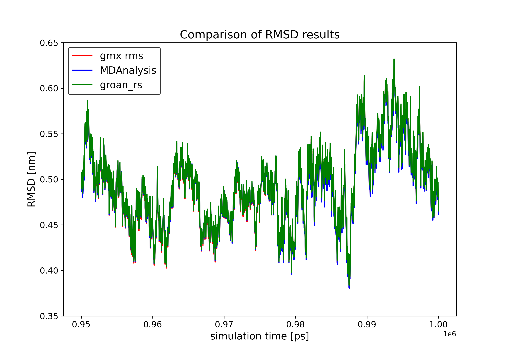
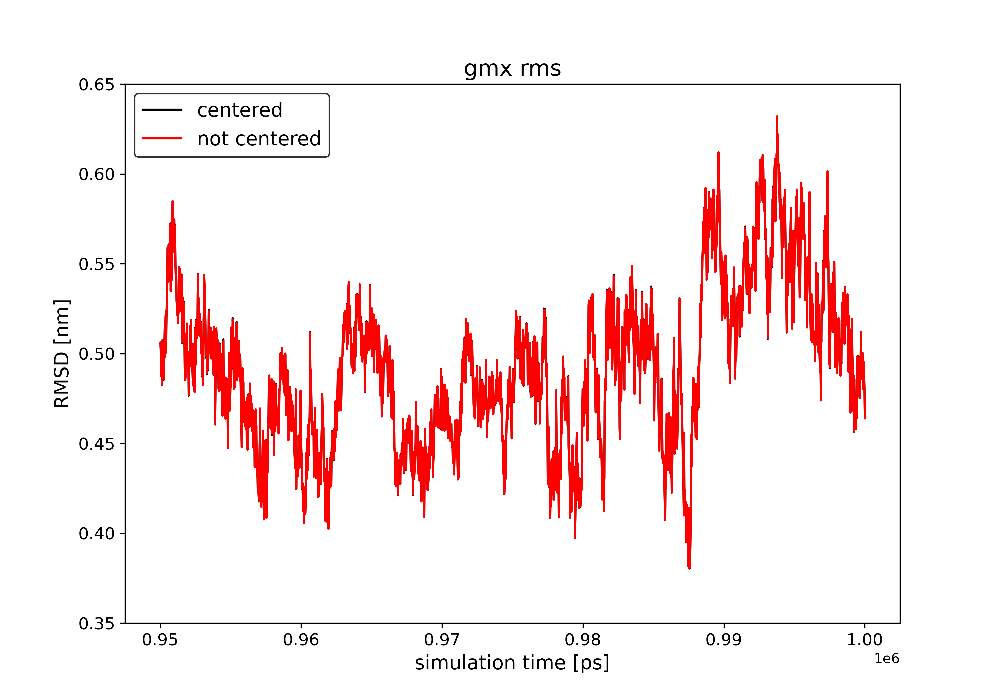
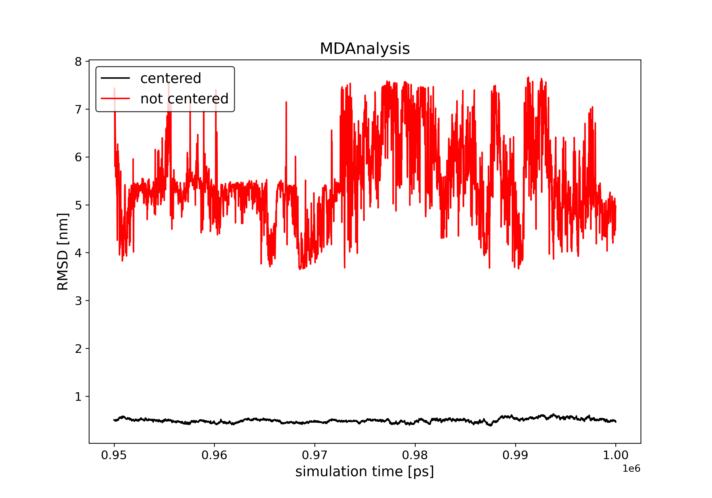
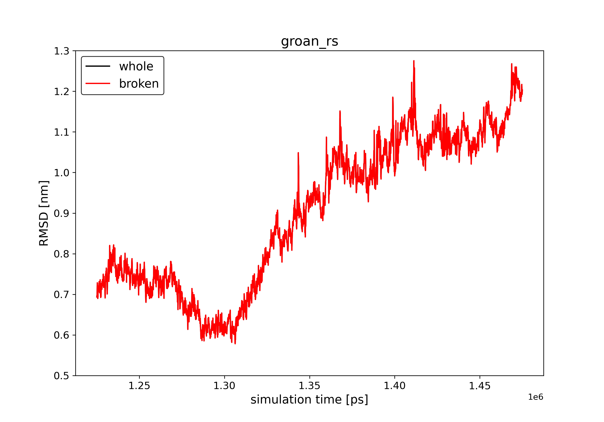
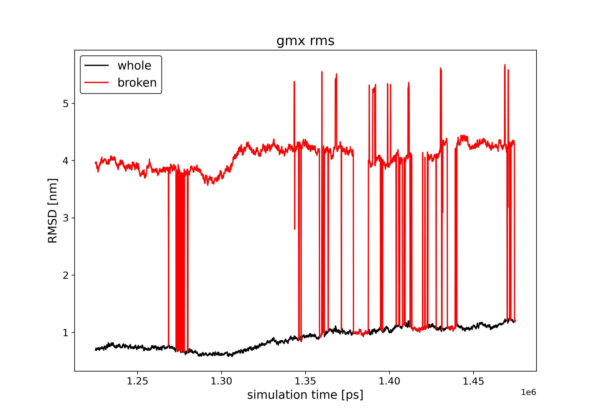
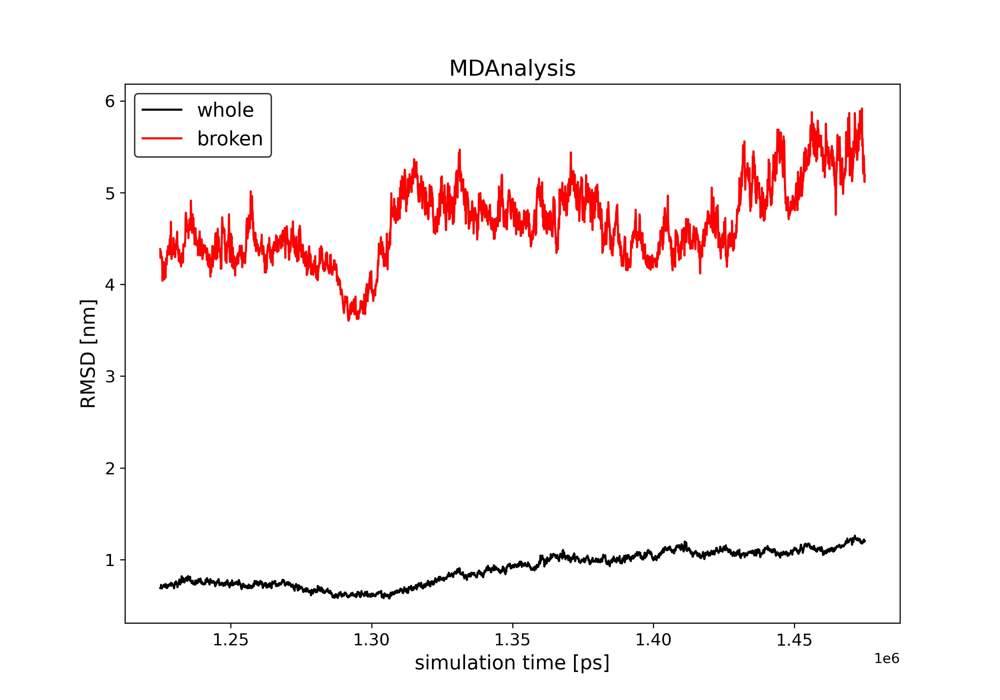

## RMSD Calculation Validation

### Analysis 1

Analyzed 2500 frames (simulation time 950,000–1,000,000 ps) of a membrane protein simulation containing approximately ~170,000 atoms. The membrane protein is centered and whole in the simulation box. Backbone atoms of the protein were used for both fitting and RMSD calculation.

Groan, MDAnalysis, and `gmx rms` produce the same results.



**Groan code (version 0.9.0-dev.2):**
```rust
fn calculate_rmsd() -> Result<(), Box<dyn Error + Send + Sync>> {
    let mut system = System::from_file(SYSTEM_TPR)?;
    system.read_ndx(NDX_FILE)?;
    let reference = system.clone();

    let (rmsds, time): (Vec<f32>, Vec<f32>) = system
        .xtc_iter(TRAJECTORY_XTC)?
        .calc_rmsd(&reference, "Backbone")?
        .map(|result| result.map(|(frame, rmsd)| (rmsd, frame.get_simulation_time())))
        .collect::<Result<Vec<_>, _>>()?
        .into_iter()
        .unzip();

    for (t, r) in time.into_iter().zip(rmsds.into_iter()) {
        println!("{} {}", t, r);
    }

    Ok(())
}
```

**Gromacs RMS (version 2022.3):**
```bash
yes 4 4 | gmx rms -s ${SYSTEM_TPR} -f ${TRAJECTORY_XTC} -n ${NDX_FILE} -o ${OUTPUT_FILE}
```

**MDAnalysis code (version 2.6.1):**
```python
import MDAnalysis as mda
from MDAnalysis.analysis.rms import RMSD

ref = mda.Universe(SYSTEM_GRO)   # MDAnalysis could not read the TPR file.
ref = ref.select_atoms("backbone")
u = mda.Universe(SYSTEM_GRO, TRAJECTORY_XTC)
backbone = u.select_atoms("backbone")
rmsd = RMSD(backbone, ref, verbose=True)
rmsd.run()

rmsd = rmsd.results.rmsd.T
times = rmsd[1]
values = rmsd[2]

with open(OUTPUT_FILE, "w") as f:
    for time, val in zip(times, values):
        f.write(f"{time} {val / 10.0}\n")
```

***

### Analysis 2

Analyzed the same simulation, but in this case, the protein is not centered in the simulation box and is frequently "broken" across periodic boundaries (i.e., the molecule is not whole). Even using this trajectory, both groan and `gmx rms` calculate the RMSD correctly:




However, MDAnalysis returns a completely incorrect result:



(Note that MDAnalysis specifically warns users that it cannot properly calculate RMSD for trajectories in which the fitted molecule is not whole. Thus, the result is *expectedly* wrong and is not due to the absence of connectivity information supplied to MDAnalysis.)

***

### Analysis 3

Analyzed a simulation of a protein dimer, i.e., two proteins that are close to each other but unconnected. RMSD was calculated for the backbone of the dimer using both the raw, unmodified trajectory (where the dimer can be broken at periodic boundaries) and a trajectory where the proteins were made whole in the simulation box.

In this case, only the groan library returns the correct result for the raw trajectory. Both `gmx rms` and MDAnalysis fail:






